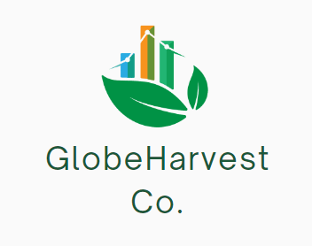

# Project Overview: Optimizing Sourcing and Pricing Strategies for GlobeHarvest Co. in Kenya

[Slides](https://www.canva.com/design/DAGEoDs9c_A/jkymq6SIxKdztrvSyO6Y2A/edit)

[Data report](https://docs.google.com/document/d/1UlScpYEa-ohARww3cQ98fCJkoT1UenppYj7cit2m6KU/edit)

## Introduction
GlobeHarvest Co. is an emerging import-export company poised to enter the Kenyan agricultural market. With a commitment to leveraging data-driven strategies, GlobeHarvest aims to optimize its sourcing and pricing strategies to establish a competitive presence in Kenya's agricultural sector. By harnessing the power of data analytics, GlobeHarvest seeks to gain valuable insights into market dynamics, consumer preferences, and pricing trends to drive informed decision-making and maximize profitability.

## Business Understanding
Kenya's agricultural market offers immense potential for GlobeHarvest Co., characterized by diverse regions with varying agricultural capabilities and consumer demands. However, navigating this complex landscape presents several challenges, including identifying cost-effective sourcing locations, strategically timing purchases, and ensuring competitive pricing amid price variabilities across regions. To succeed in the Kenyan market, GlobeHarvest must develop a deep understanding of market dynamics, consumer behavior, and competitive factors to optimize its procurement processes and pricing strategies effectively.

## Problem Statement
GlobeHarvest Co. faces the following key challenges in entering the Kenyan agricultural market:

- **Identifying Optimal Sourcing Locations:** The company needs to identify the most cost-effective sourcing locations across different Kenyan counties to minimize procurement costs and ensure a reliable supply chain.
- **Timing Purchases Strategically:** GlobeHarvest requires insights into the optimal timing for purchasing various commodities, considering seasonal fluctuations, market trends, and price dynamics.
- **Navigating Price Variabilities:** Significant price discrepancies exist across different regions in Kenya, necessitating a systematic approach to ensure competitive pricing and optimize profitability.

## Objectives
The primary objectives of GlobeHarvest Co. in optimizing its sourcing and pricing strategies for the Kenyan market are as follows:

1. **Identify Cost-Effective Sourcing Locations:** Analyze data to identify regions in Kenya that offer the most cost-effective sourcing opportunities for various food commodities.
2. **Strategically Time Purchases:** Utilize historical data and market insights to determine the optimal timing for purchasing specific commodities, considering seasonal trends and market dynamics.
3. **Navigate Price Variabilities:** Develop strategies to navigate price variabilities across different regions in Kenya, ensuring competitive pricing and maximizing profitability.

## Data Understanding
The dataset obtained from WFP Kaggle consists of food price data collected in Kenya, providing valuable insights into the pricing dynamics of various food commodities across different regions and markets.
The dataset contains 10,767 rows, each representing a unique observation of food prices in a specific market on a particular date. This dataset provides a comprehensive view of food pricing trends and variations across different regions and market types in Kenya, offering valuable insights for analysis and decision-making in the agricultural sector.

### Data Visualizations

## Modelling
### Model Selection
In this section, various machine learning models are evaluated and compared to select the most suitable one for predicting future prices of wholesale commodities.

### Linear Regression Model
The linear regression model was the first one attempted. Here are the results:

Mean Squared Error (MSE): 202.87
Coefficient of Determination (R^2 Score): 0.7943

### Random Forest Regressor
Next, a Random Forest Regressor was trained and evaluated:

Mean Squared Error (MSE): 96.62
Coefficient of Determination (R^2 Score): 0.9020

### Gradient Boosting Regressor
A Gradient Boosting Regressor was also tested:

Mean Squared Error (MSE): 96.62
Coefficient of Determination (R^2 Score): 0.9020

### Decision Tree Regressor
Lastly, a Decision Tree Regressor was included:

Mean Squared Error (MSE): 211.58
Coefficient of Determination (R^2 Score): 0.7855

### Model Evaluation
Comparing the models, the Random Forest Regressor outperformed the others in terms of both MSE and R^2 Score.

Random Forest Regressor: MSE = 96.62, R^2 = 0.9020
Gradient Boosting Regressor: MSE = 96.62, R^2 = 0.9020
Linear Regression: MSE = 202.87, R^2 = 0.7943
Decision Tree Regressor: MSE = 211.58, R^2 = 0.7855
Therefore, the Random Forest Regressor was chosen as the final model.

### Hyperparameter Tuning
To optimize the Random Forest model further, a grid search was performed to find the best hyperparameters:

Best Hyperparameters: {'max_depth': None, 'min_samples_leaf': 2, 'min_samples_split': 5, 'n_estimators': 100}

### Final Model
After tuning, the Random Forest Regressor with the best hyperparameters was evaluated on the test set:

Mean Squared Error (MSE): 27.31
Coefficient of Determination (R^2 Score): 0.9723
The significantly reduced MSE and improved R^2 score demonstrate the effectiveness of the tuned Random Forest model in predicting future wholesale commodity prices.

## Predicting Prices Using the Model
Input Data:
The input data consists of historical wholesale prices of various commodities categorized by provinces, food categories, commodities, years, months, and corresponding prices per unit.

Example Prediction:
For instance, predicting the wholesale price of maize (white, dry) in Central Province for May 2024 involves providing specific input parameters like province, food category, commodity, year, and month.

Prediction Methodology:
We utilized a Random Forest Regressor, which demonstrated high accuracy after tuning, achieving a 97% accuracy rate.

Predicting Function:
A function was created to handle predictions. It processes the input parameters, converts them into a format suitable for the model, and generates a forecasted price per standard unit.

Deployment:
The model was deployed as a user-friendly web application. Stakeholders can input relevant details, and the predicted price per standard unit is displayed promptly on-screen.

## Conclusion
In conclusion, this project aimed to develop a robust system for predicting wholesale prices of food commodities. By leveraging machine learning techniques, we achieved high accuracy in price predictions, facilitating informed decision-making for stakeholders. Moving forward, ongoing data augmentation and real-time data integration will further enhance the system's accuracy and relevance.

## Recommendations
## <b>7. Recommendations</b>

The following are the recommendations to be made after undertaking this project. This will also include ways to improve the system in future and general observations. These include;
 - Global Harvest Co. should prioritize investments in acquiring and selling cereals and tubers, capitalizing on their high-demand
 - Focus on provinces like Coast for sourcing and Rift Valley, North Eastern, and Nairobi for retail sales could optimize profits.
 - Global Harvest Co. should consider sourcing from cluster 1 to minimize procurement costs and enhance competitiveness.
 - Global Harvest Co. can forecast prices using the Random Forest Regressor model, enabling better procurement and pricing strategies.
 - Complete data can be acquired from other trusted sources to make the information more complete. This will improve prediction accuracy.
 - More recent data can be acquired from the World Food Program since this data is updated monthly. This could be via api integration so as to make this process automatic.
 
 Here are the best months to buy each of the top 20 commodities in your dataset, based on the lowest average price:

- **Bananas** - October (Average price: 11.63 KES)
- **Beans** - August (Average price: 55.94 KES)
- **Beans (dry)** - September (Average price: 81.15 KES)
- **Beans (yellow)** - January (Average price: 108.62 KES)
- **Cabbage** - September (Average price: 19.98 KES)
- **Kale** - January (Average price: 22.06 KES)
- **Maize** - September (Average price: 33.70 KES)
- **Maize (white)** - March (Average price: 37.34 KES)
- **Maize (white, dry)** - January (Average price: 41.37 KES)
- **Maize flour** - September (Average price: 62.36 KES)
- **Milk (UHT)** - September (Average price: 114.19 KES)
- **Oil (vegetable)** - September (Average price: 198.68 KES)
- **Onions (dry)** - August (Average price: 51.82 KES)
- **Potatoes (Irish)** - August (Average price: 38.19 KES)
- **Rice** - September (Average price: 97.51 KES)
- **Salt** - August (Average price: 51.32 KES)
- **Sorghum** - March (Average price: 45.36 KES)
- **Sugar** - August (Average price: 104.28 KES)
- **Tomatoes** - January (Average price: 49.68 KES)
- **Wheat flour** - September (Average price: 68.64 KES)

These prices are averages for the months listed, suggesting potentially the best times to make purchases to benefit from lower costs.

 Global Harvest Co. should `consider sourcing from cluster 1` to minimize procurement costs and enhance competitiveness.

## Deployment
Exporting Model and Data:

`/deployment/` Folder

The trained model was exported using the pickle library. Additionally, the wholesale and encoded data were exported to CSV files.

Web Application:
https://itunda.streamlit.app/

The deployed web application allows users to input parameters such as location, food category, commodity, year, and month. Subsequently, the model generates and displays the predicted price per standard unit.

Real-time Data Integration:
Integrating real-time data sources, such as the World Food Program API, could automate data updates, ensuring the system reflects current market trends.

Thank you.

